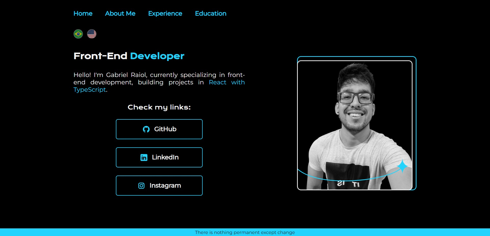

<h1>Gabriel Raiol | Portfolio</h1>
 

 
<a href="https://raiol.vercel.app/" target="_blank">Link to portfolio</a>
 

This was my first responsive HTML/CSS project, and I use it to this day. When there is a need I update some information or, if I like some feature learned, add it.

